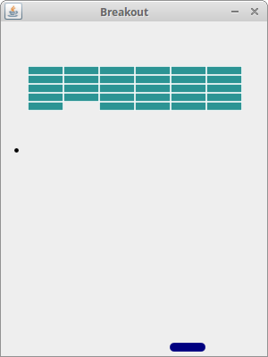

# Java Breakout Game - Refactored
Java Breakout game source code

http://zetcode.com/javagames/breakout/

This is an academic project aimed at refactoring the classic Breakout game by applying **Software Design Patterns** without adding new gameplay features.

## Design Patterns Implemented
- **Singleton Pattern:** Refactored `Commons.java` into `GameConfig.java` to manage application settings with a single instance.

## Credits & Acknowledgments
- **Original Source Code:** ZetCode Java Breakout Game Tutorial.
- **Refactoring & Design Patterns:** Academic assignment for Software Design Patterns course.

